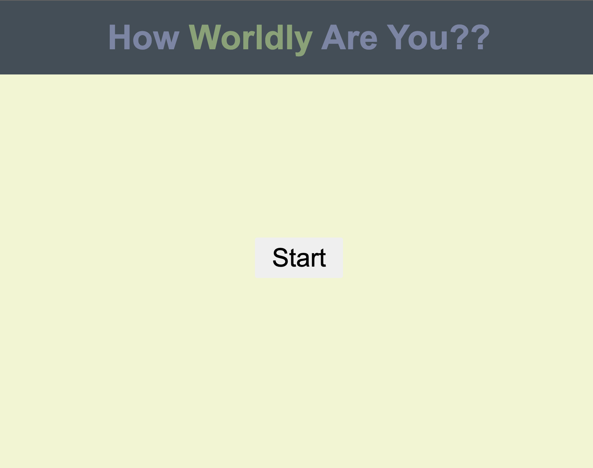
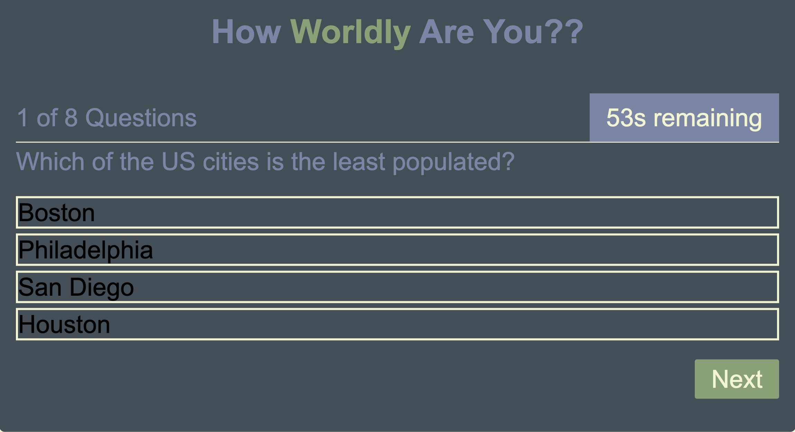
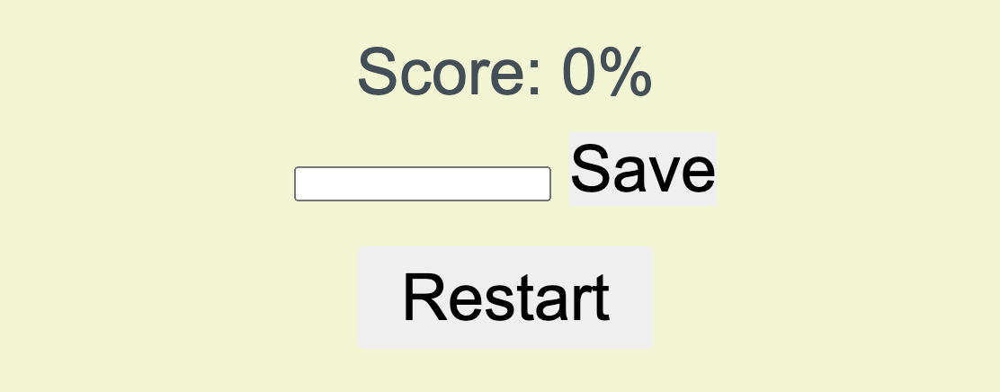

# quiz-app
[](code_of_conduct.md)

## The Repository

This repository was made from scratch to create a quiz with JavaScript and Web APIs. Take the quiz and see how worldly you are!

---

## Installation

The code may be accessed on [GitHub](https://github.com/choelzli/quiz-app) or by visiting the site URL (https://choelzli.github.io/quiz-app/).

Clone the repo:
```
git clone https://github.com/choelzli/quiz-app.git
```

---

## Usage

Upon accessing the webpage, it displays a title, header, and a start button to begin the quiz.  



Clicking the start button presents the user with the first question and a running timer.  



Upon completing the quiz or timing out, the score is displayed with options to save the user's score to local storage and restart the quiz.


---

## License

Licensed under the MIT license.

---

## Credits

Base code strategies provided by Columbia Coding Bootcamp. Other sources include:
* [The Contributor Covenant](https://www.contributor-covenant.org/)
* [GitHub: jamesqquick/Build-A-Quiz-App-With-HTML-CSS-and-JavaScript](https://github.com/jamesqquick/Build-A-Quiz-App-With-HTML-CSS-and-JavaScript)
* [MDN Web Docs: cursor](https://developer.mozilla.org/en-US/docs/Web/CSS/cursor)
* [README Template](https://github.com/othneildrew/Best-README-Template)
* [Stack Overflow: Subtract time from timer if answer is wrong, creating a quiz javascript](https://stackoverflow.com/questions/58964755/subtract-time-from-timer-if-answer-is-wrong-creating-a-quiz-javascript)
* [VS Code README](https://github.com/microsoft/vscode/tree/main)